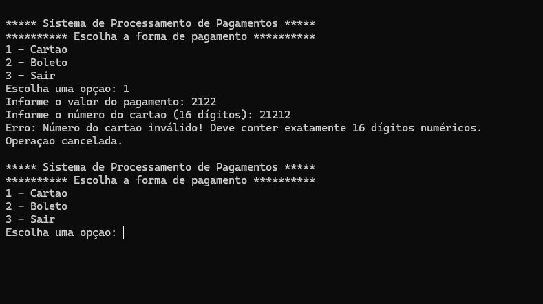
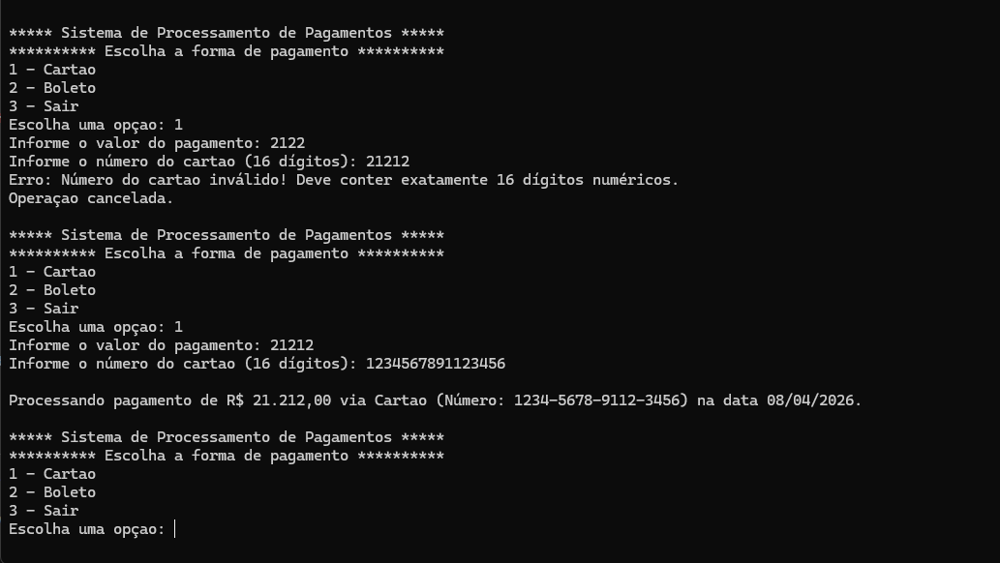
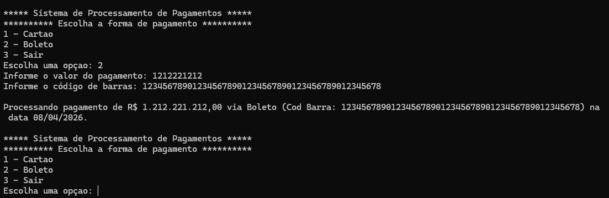
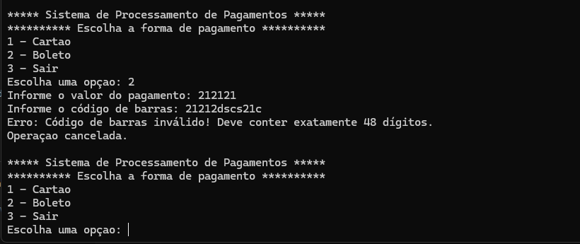
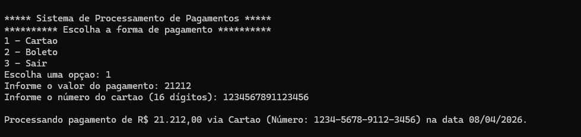

# Sistema de Processamento de Pagamentos

Aplicação de console desenvolvida em C# para simular o processamento de pagamentos via cartão de crédito e boleto bancário.

---

## Integrantes

* Denise Senise RM 556006
* Larissa Rodrigues Lapa RM 554517
* Mateus Leme RM 557803
* David Gabriel Gomes Fernandes RM 556020
* Vinicius Augusto Neves Prestes RM 559097

---

## Descrição do Projeto

Este sistema permite ao usuário realizar pagamentos através de um menu interativo no console.

As opções disponíveis são:

1. Pagamento com Cartão de Crédito
2. Pagamento com Boleto Bancário
3. Sair do sistema

O sistema realiza validações de entrada e tratamento de erros, garantindo maior segurança e confiabilidade na simulação.

---

## Funcionalidades

* Pagamento com cartão
* Pagamento com boleto
* Menu interativo contínuo
* Validação de entradas
* Tratamento de exceções
* Cancelamento automático de operações inválidas

---

## Regras de Negócio

* O valor deve ser um número decimal válido
* Aceita separador decimal com vírgula ou ponto
* O número do cartão deve conter 16 dígitos
* O código de barras deve ser válido
* Em caso de erro:

---

## Evidências de Testes

### Pagamento com Cartão

**Teste válido:**

**Teste inválido (erro):** 

---

### Pagamento com Boleto

**Teste válido:**

**Teste inválido (erro):** 

---

## Exemplo de Execução

